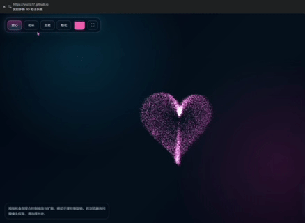
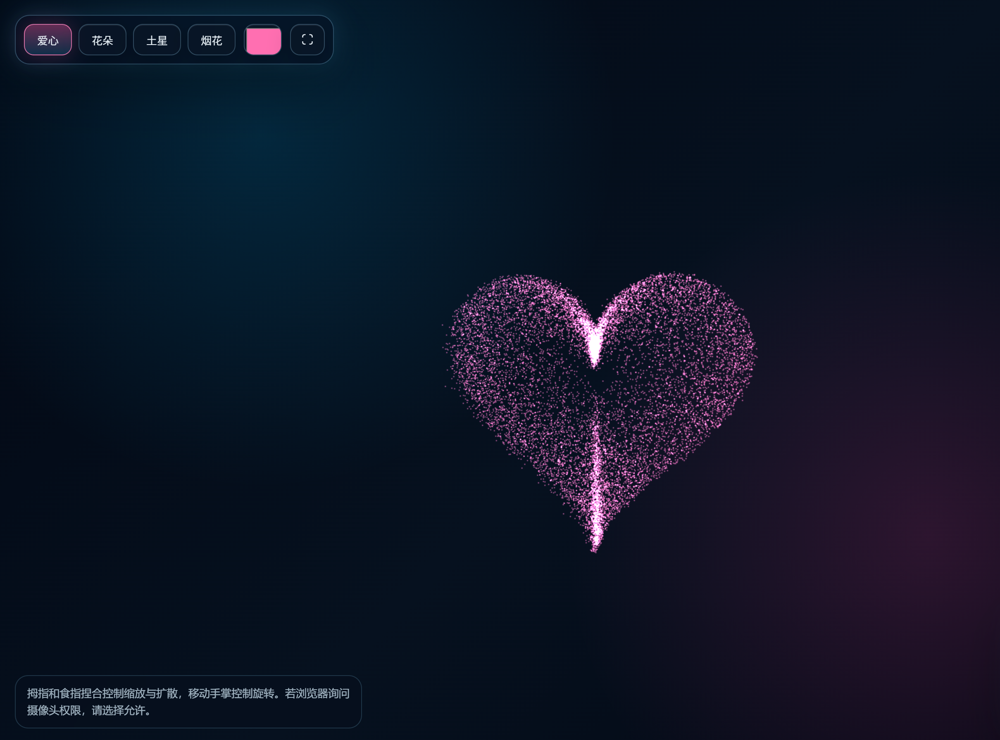
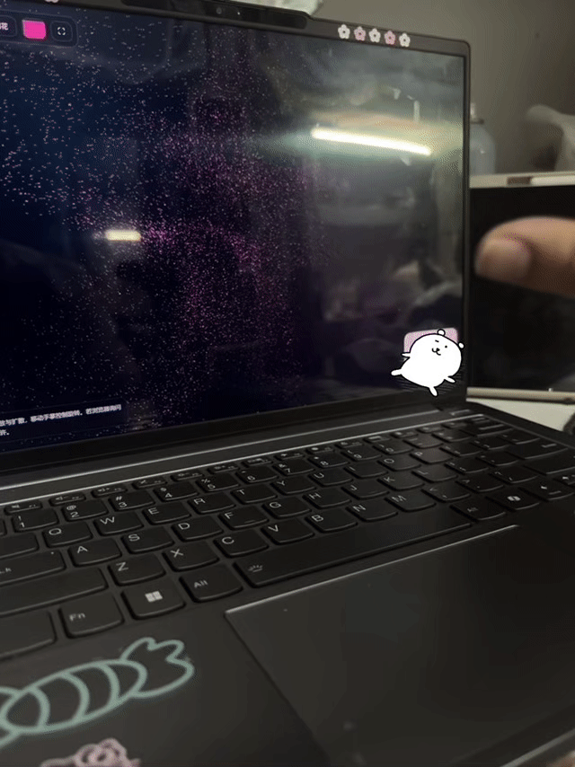
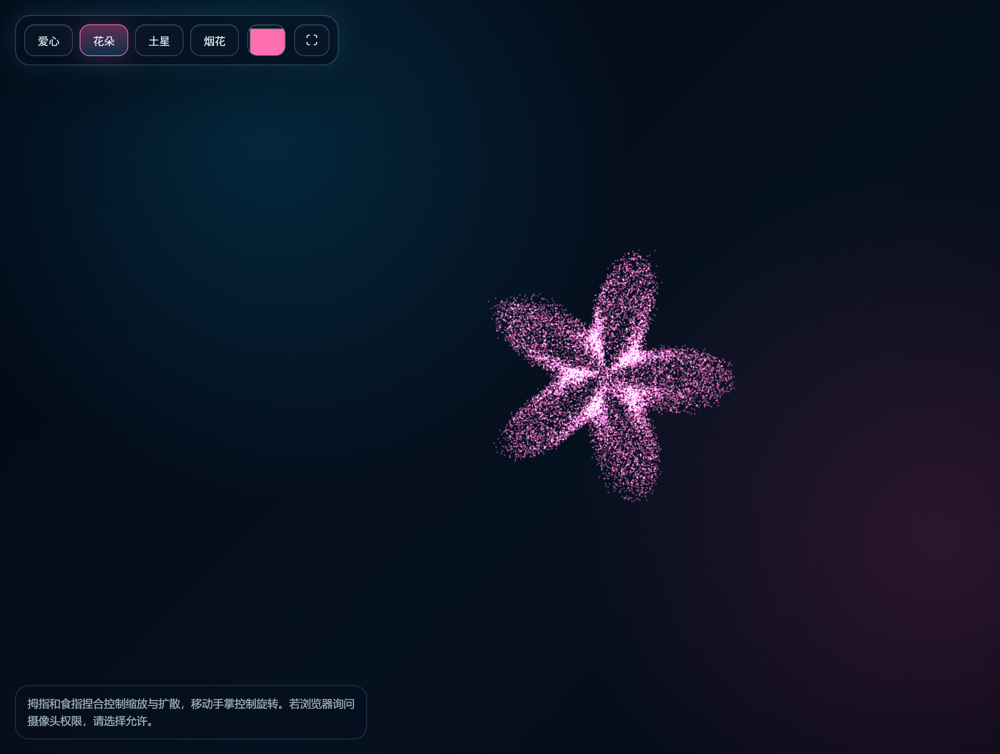
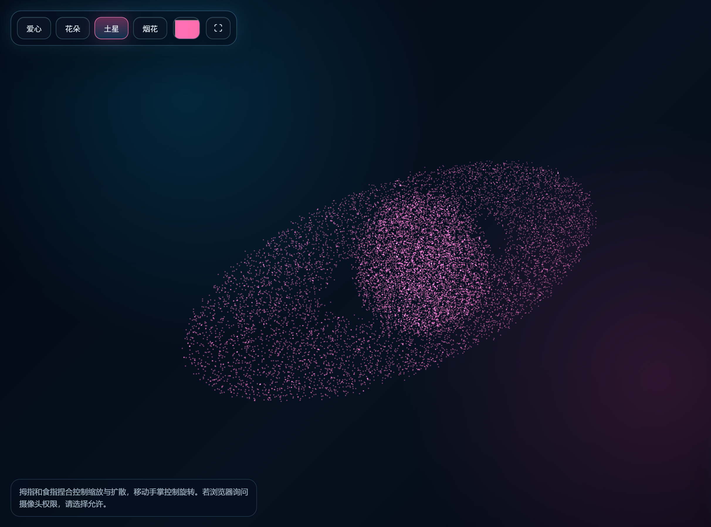
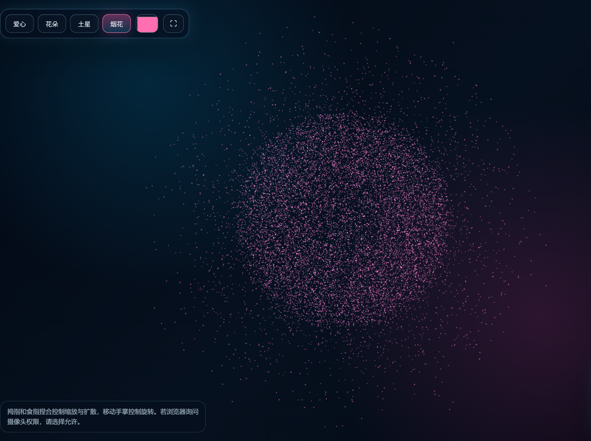

# AI 3D Particle System

Interactive 3D particle experience built with Three.js and MediaPipe Hands.

---

# ✨ Demo Preview

---

# 🌌 Features

- Real-time 3D particle rendering
- Interactive particle morphing
- Gesture-controlled interaction
- Pinch-to-zoom support
- Hand-controlled rotation
- Multiple particle modes
- Immersive fullscreen visual experience

---

# 🎮 Particle Modes

## ❤️ Heart

---

## 🌸 Flower

---

## 🪐 Saturn

---

## 🎆 Firework

---

# 🖐 Gesture Interaction

- Open hand rotation
- Pinch gesture zoom
- Interactive camera control

---

# 🛠 Tech Stack

- Three.js
- MediaPipe Hands
- WebGL
- JavaScript
- HTML5
- CSS3

---

# 🚀 Live Demo

https://yuzzz77.github.io/AI-3D-Particle-System/

---

# 💡 Inspiration

This project explores the combination of AI interaction, gesture recognition, and immersive particle visualization in creative web experiences.

---

# 📌 Future Plans

- Audio reactive particles
- AI-generated particle shapes
- Dynamic shaders
- More interaction modes
- Mobile optimization
- Advanced control panel

---

# 📄 License

MIT License
